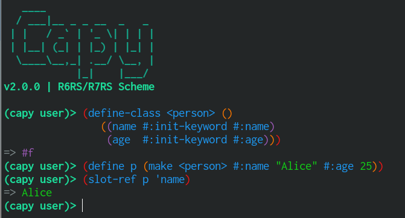

# CapyScheme

R6RS/R7RS compiler and runtime written in Rust.



# Capy 2.0.0

Capy 2.0.0 is a large compiler, runtime, and library release.

- Compiler work now centers on the linear CPS pipeline, SSA lowering, native x64 code generation, and FASL code artifacts.
- Runtime work includes FFI callbacks, native extension loading, thread interrupts, yieldpoints, conservative stack scanning, UTF-8 API helpers, and improved source/error handling.
- GC work includes configurable trigger policies, adaptive/compact/aggressive heuristics, benchmarks, cache locking, and alignment fixes.
- The object system now has `define-class`, `define-generic`, `define-method`, next-method dispatch, sealed/locked generics, class redefinition, slot helpers, and runtime class/generic descriptors.
- Language and library additions include implicit `#%app` routing, `define-property`, `call-in-continuation`, terminal support, SRFI-213, SRFI-64 comparator support, and automatic Capy prelim imports.
- The fancy REPL, test runner, package builds, and CI/release automation also received updates for this release.

# Goals

- Continuation-Passing Style compiler based on [Compiling with Continuations, Continued](https://www.microsoft.com/en-us/research/wp-content/uploads/2007/10/compilingwithcontinuationscontinued.pdf), with native-code generation and FASL compilation.
- Runtime with support for loading modules, native extensions, and fast GC.
- User-friendly: develop standard library and set of utilities to make using Scheme easier.
- Interactive: Provide a REPL with completion, syntax rendering, bracket matching, and reader diagnostics.

# R6RS/R7RS support

Most of R6RS and R7RS-small should be "just working" apart from some bugs. R6RS test-suite from [racket/r6rs](https://github.com/racket/r6rs) is used to guide development and at the moment 99.3% of tests are passing.

To run tests yourself:
```sh
$ capy --r6rs -L . -s tests/r6rs/run-via-eval.sps
```

Capy defaults to R7RS mode. Use `--r6rs` when extensionless imports should
search R6RS `.sls` and `.sps` files, and `--r7rs` when they should search R7RS
`.sld` files. See [Using CapyScheme](docs/USAGE.md) for execution modes, load
paths, compiled `.fasl` artifacts, and common source-loading pitfalls.

# Documentation

- [Installation](INSTALLATION.md) covers release tarballs and source installs.
- [Using CapyScheme](docs/USAGE.md) covers execution modes, load paths, and
  compiled artifacts.
- [Bootstrapping CapyScheme](docs/BOOTSTRAP.md) covers build, test, install, and
  packaging workflows.
- [Implementation](docs/IMPLEMENTATION.md) outlines the compiler pipeline.

## Thanks

Big thanks to authors of [Larceny](https://github.com/larcenists/larceny), [Guile](https://www.gnu.org/software/guile/) and [Ypsilon](https://github.com/fujita-y/ypsilon). CapyScheme uses stdlib parts from all of them and takes inspiration from them.
